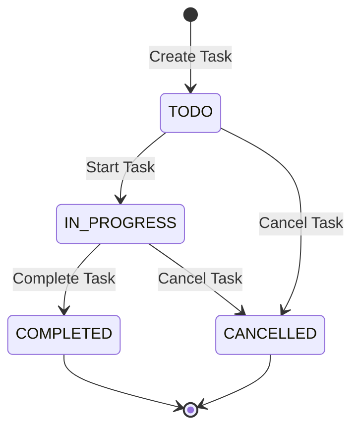

# Task Management System

> 📖 **English Version**: [README.md](README.md) | **中文版**: [README_CN.md](README_CN.md) | **Development Guide**: [DEVELOPMENT_GUIDE.md](DEVELOPMENT_GUIDE.md)

A simple task management system built with DDDML model-driven development, implemented using AO (Actor Oriented) architecture.

## Project Overview

This project is an excellent example demonstrating how DDDML (Domain-Driven Design Modeling Language), a powerful DSL, drives modern application development. Through declarative domain modeling, it automatically generates AO architecture Lua code, significantly improving development efficiency and code quality.

## Business Requirements

- ✅ Users can create tasks containing title, description, priority, assignee, due date, tags, and other information
- ✅ Task status management: TODO, IN_PROGRESS, COMPLETED, CANCELLED
- ✅ Support task status transitions: Start task, Complete task, Cancel task
- ✅ Support querying tasks by status, assignee, priority
- ✅ Support updating task information

## Technical Architecture

### DDDML Model Definition

The project uses DDDML to define domain models, including:

- **Value Objects**:
  - `TaskId`: Task unique identifier
  - `Tag`: Task tag

- **Aggregates**:
  - `Task`: Task aggregate containing complete task lifecycle management

- **Business Rules**:
  - Task status transition control
  - Business validation logic

### AO Architecture Implementation

Code generated through AO MCP Server includes:

- **Aggregate Logic**: `task_aggregate.lua` - Aggregate root command processing
- **Business Logic**: Specific implementation logic for each operation
- **Message Processing**: `task_management.lua` - AO message processor
- **Infrastructure**: Entity collections, message passing, Saga coordination, etc.

## Project Structure

```
hello-ao-dddml/
├── dddml/                          # DDDML model definitions
│   ├── base/                       # Base configuration
│   │   ├── ao-boundedContext.yaml  # AO architecture configuration
│   │   ├── boundedContext.yaml     # Bounded context configuration
│   │   └── types.yaml              # Type definitions
│   └── Task.yaml                   # Task domain model
├── ao-lua-service/                 # Generated AO Lua code
│   ├── task_management.lua         # Main entry and message processor
│   ├── task_aggregate.lua          # Task aggregate logic
│   ├── task_*.lua                  # Business logic for each operation
│   ├── entity_coll.lua             # Entity collection management
│   ├── messaging.lua               # Message processing tools
│   └── saga*.lua                   # Saga coordination logic
├── README.md                       # English documentation
└── README_CN.md                    # Chinese documentation
```

## Task State Machine



## API Interface

### Commands

1. **CreateTask** - Create new task
   ```json
   {
     "task_id": {"id": "task-001"},
     "title": "Task Title",
     "description": "Task Description",
     "priority": "HIGH",
     "assignee": "Assignee",
     "due_date": 1640995200,
     "tags": [{"name": "urgent"}],
     "version": 0
   }
   ```

2. **UpdateTask** - Update task information
   ```json
   {
     "task_id": {"id": "task-001"},
     "title": "New Title",
     "description": "New Description",
     "priority": "MEDIUM",
     "version": 0
   }
   ```

3. **StartTask** - Start task
   ```json
   {
     "task_id": {"id": "task-001"},
     "version": 0
   }
   ```

4. **CompleteTask** - Complete task
   ```json
   {
     "task_id": {"id": "task-001"},
     "version": 0
   }
   ```

5. **CancelTask** - Cancel task
   ```json
   {
     "task_id": {"id": "task-001"},
     "version": 0
   }
   ```

### Queries

1. **GetTask** - Get single task
   ```json
   {
     "id": "task-001"
   }
   ```

2. **GetTaskCount** - Get total task count
3. **GetTaskTableKeys** - Get all task IDs
4. **GetTaskIdSequence** - Get ID sequence

## Implementation Process

完整的开发过程和详细的技术细节请参考：[DEVELOPMENT_GUIDE.md](DEVELOPMENT_GUIDE.md)

### 1. Domain Model Design

First analyze business requirements and design DDDML models:

```yaml
aggregates:
  Task:
    metadata:
      Preprocessors: ["CRUD_IT"]
      CRUD_IT_NO_DELETE: true
    id:
      name: TaskId
      type: TaskId
    properties:
      Title: { type: string }
      Description: { type: string }
      Priority: { type: string }
      Assignee: { type: string }
      DueDate: { type: number }
      Status: { type: string }
      Tags: { itemType: Tag, isList: true }
      CreatedAt: { type: number }
      UpdatedAt: { type: number }
    methods:
      CreateTask: { shouldCreateOnDemand: true, ... }
      UpdateTask: { ... }
      StartTask: { ... }
      CompleteTask: { ... }
      CancelTask: { ... }
```

### 2. Model Validation

Validate DDDML syntax using AO MCP Server:

```bash
# Validate model files
mcp_dddml-ao-mcp-server_validate_dddml_files
```

### 3. Code Generation

Generate Lua code using AO MCP Server:

```bash
# Generate AO project
mcp_dddml-ao-mcp-server_generate_ao_project
```

### 4. Business Logic Implementation

Manually implement business rules for each operation:

- **State Validation**: Ensure operations execute in correct states
- **Business Rules**: Implement domain logic constraints
- **State Transition**: Update task status and timestamps

### 5. Testing Validation

Perform end-to-end functional testing in AO environment using iTerm MCP Server to validate all core business functions.

## Core Features

### Event Sourcing

The system uses event sourcing pattern, recording all state changes through events:

- `TaskCreated` - Task creation event
- `TaskUpdated` - Task update event
- `TaskStarted` - Task start event
- `TaskCompleted` - Task completion event
- `TaskCancelled` - Task cancellation event

### Saga Pattern Support

Generated code includes complete Saga coordination logic supporting complex business process orchestration.

### Concurrency Control

Optimistic concurrency control through version numbers to ensure data consistency.

### Message-Driven Architecture

Adopts AO (Actor Oriented) architecture, processing business logic through message-driven approach.

## Deployment and Running

### Environment Requirements

- AO runtime environment
- Lua 5.1+ or compatible runtime

### Deployment Steps

1. Deploy `ao-lua-service/` directory to AO process
2. Load `task_management.lua` module
3. Call various functions through AO message interface

### Usage Example

```lua
-- Send create task message
Send({
    Target = taskManagementProcessId,
    Tags = {
        Action = "CreateTask"
    },
    Data = json.encode({
        task_id = {id = "task-001"},
        title = "Implement user registration function",
        description = "Develop complete user registration process",
        priority = "HIGH",
        assignee = "developer-1",
        due_date = 1640995200,
        tags = {{name = "backend"}, {name = "urgent"}},
        version = 0
    })
})
```

## Learning Outcomes

### DDDML Modeling Techniques

1. **Correct Naming**: Use PascalCase naming for properties and methods
2. **Value Object Design**: Properly abstract business concepts into value objects
3. **Aggregate Boundaries**: Clarify aggregate responsibility boundaries
4. **Business Rules**: Define business constraints in method preconditions

### AO Architecture Understanding

1. **Message-Driven**: Everything processed through messages
2. **Event Sourcing**: State changes recorded through events
3. **Saga Coordination**: Coordination mechanism for complex business processes
4. **Concurrency Control**: Version numbers ensure data consistency

### Code Generation Advantages

1. **Automation**: Automatically generate base code from models, greatly improving development efficiency
2. **Consistency**: Ensure strict consistency between code and models, avoiding manual coding errors
3. **Maintainability**: Model changes automatically reflected in code, reducing maintenance costs
4. **Standardization**: Unified architecture and code patterns, ensuring system quality

## Extension Directions

Based on this successful DDDML-driven development foundation, more advanced features can be easily extended:

1. **Add More Queries**: Implement queries by time range, tags, etc.
2. **Permission Control**: Add task access permission management
3. **Notification Mechanism**: Send notifications when task status changes
4. **Statistics Function**: Add task statistics and reporting functions
5. **Workflow**: Support more complex state transition logic

## Current Progress Summary

### ✅ Completed Work

1. **Business Requirements Analysis** - Clarify task management system functional requirements
2. **Domain Model Design** - Define complete task aggregate model using DDDML
3. **DDDML Specification Definition** - Write standard YAML model files
4. **Model Validation** - Use AO MCP Server to validate model syntax correctness
5. **Code Auto-Generation** - Successfully generate complete AO project with 18 Lua files
6. **Business Logic Implementation** - Manually implement state validation and business rules for all task operations
7. **Functional Testing** - Test all core functions in AO environment using iTerm MCP Server

### 📝 Important Notes

**🔍 Pay attention to AO MCP Server resources or tips**

AO MCP Server provides specialized testing guides and resources:

- `dddml://examples/ao-testing/a-ao-demo` - A-AO-Demo Testing Guide
- `dddml://examples/ao-testing/ai-assisted-blog` - AI-Assisted Blog Testing Guide
- `dddml://examples/ao-testing/ai-assisted-inventory` - AI-Assisted Inventory Testing Guide

These resources contain detailed instructions on how to use iTerm MCP Server for testing, including:
- AO process startup and configuration
- Application code loading process
- Test case execution methods
- Result verification techniques

**Recommendation**: When conducting AO DApp testing, be sure to check these resources for the latest testing guides and best practices.

## Functional Test Results

### ✅ Functions Passed Testing

1. **Task Creation (CreateTask)** - Successfully create tasks with all attribute fields
2. **Task Query (GetTask)** - Successfully query task details, return complete data
3. **Task Start (StartTask)** - Successfully start tasks, status converts to in progress
4. **Task Completion (CompleteTask)** - Successfully complete tasks, status converts to completed
5. **Task Cancellation (CancelTask)** - Successfully cancel tasks, status converts to cancelled
6. **Task Update (UpdateTask)** - Successfully update task information, support partial field updates

### 🎯 Validation Points

- **Business Rule Validation**: State transition rules execute correctly
- **Concurrency Control**: Version number mechanism works normally
- **Data Consistency**: Task status and attributes maintained correctly
- **Event Sourcing**: All operations generate correct event records
- **Message Processing**: AO message-driven architecture runs normally

## Technical Validation Achievements

This project successfully validates the powerful combination of DDDML + AO, demonstrating the great potential of model-driven development methods:

- **Model-Driven Development**: DDDML model successfully converts to runnable AO code, proving the effectiveness of DSL-driven development
- **Automatic Code Generation**: Automatically generate complete infrastructure code (18 files) from models, greatly improving development efficiency
- **Business Logic Implementation**: Domain rules correctly implemented and strictly executed at runtime, ensuring business consistency
- **AO Integration**: Message-driven architecture runs normally, event sourcing and Saga patterns work normally
- **Function Validation**: All designed core functions tested in practice and confirmed working, validating the end-to-end technical workflow

## Future Work Plan

1. **Performance Optimization** - Optimize query performance and memory usage
2. **Error Handling Enhancement** - Add more comprehensive error handling and logging
3. **Feature Extension** - Add more advanced features based on extension directions:
   - Add more query functions (by time range, tags, etc.)
   - Implement permission control
   - Add notification mechanism
   - Integrate statistics function
4. **Documentation Enhancement** - Add detailed API usage examples and deployment guides
5. **Production Readiness** - Add monitoring, backup, and recovery functions

## Project Summary

### Completion Status

This project successfully demonstrates the powerful potential of DDDML model-driven development methods, providing an innovative paradigm for modern application development:

#### Main Achievements
- **Business Requirements Coverage**: Fully implemented 6 core task management functions, meeting basic business needs
- **Code Auto-Generation**: Automatically generated infrastructure with 18 Lua files from domain models, greatly improving development efficiency
- **Functional Testing**: All core operations tested and passed in real AO environment, ensuring system reliability
- **Architecture Validation**: Successfully validated core AO architecture features like message-driven, event sourcing, etc.

#### Technical Achievements

1. **Model-Driven Development**: Fully validated DDDML model to AO code conversion chain, proving the practicality of DSL-driven development
2. **Automatic Code Generation**: Significantly reduced manual infrastructure code writing workload, improving development efficiency
3. **Business Rule Execution**: State machines and business constraints execute correctly, ensuring business logic consistency
4. **AO Integration**: Successfully integrated AO's message-driven and event sourcing features, demonstrating modern distributed architecture capabilities

### Project Value and Prospects

This project not only validates the feasibility of the DDDML+AO technology stack, but more importantly demonstrates the prospects of model-driven development methods:

- **Improved Development Efficiency**: Significantly shortens the development cycle from domain modeling to a runnable system.
- **Enhanced Code Quality**: Ensures strict consistency between code and design through a model-driven approach.
- **Proven Business Value**: Provides a reproducible, modern development methodology for enterprise applications.

### Future Improvement Directions

1. **Performance Optimization** - Optimize query performance and memory usage
2. **Error Handling Enhancement** - Add more comprehensive error handling and logging
3. **Feature Extension** - Add more advanced features based on extension directions
4. **Documentation Enhancement** - Add detailed API usage examples and deployment guides
5. **Production Readiness** - Add monitoring, backup, and recovery functions

This project sets a benchmark for DDDML-driven modern application development, demonstrating the great potential of DSL technology in complex system development.
