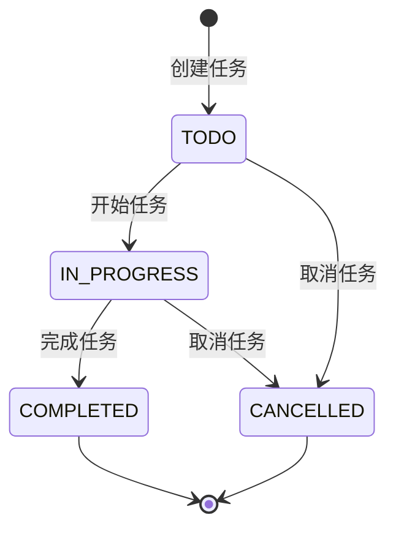

# 任务管理系统 (Task Management System)

> 📖 **English Version**: [README.md](README.md) | **中文版**: [README_CN.md](README_CN.md)

基于 DDDML 模型驱动开发的简单任务管理系统，使用 AO (Actor Oriented) 架构实现。

## 项目概述

本项目是一个优秀的示例，展示了 DDDML (Domain-Driven Design Modeling Language) 这个强大的 DSL 如何驱动现代应用开发。通过声明式的领域建模，自动生成 AO 架构的 Lua 代码，大大提升了开发效率和代码质量。

## 业务需求

- ✅ 用户可以创建任务，包含标题、描述、优先级、负责人、截止时间、标签等信息
- ✅ 任务有状态管理：待办、进行中、已完成、已取消
- ✅ 支持任务状态的流转：开始任务、完成任务、取消任务
- ✅ 支持按状态、负责人、优先级查询任务
- ✅ 支持更新任务信息

## 技术架构

### DDDML 模型定义

项目使用 DDDML 定义领域模型，包括：

- **值对象 (Value Objects)**:
  - `TaskId`: 任务唯一标识
  - `Tag`: 任务标签

- **聚合 (Aggregates)**:
  - `Task`: 任务聚合，包含完整的任务生命周期管理

- **业务规则**:
  - 任务状态流转控制
  - 业务验证逻辑

### AO 架构实现

通过 AO MCP Server 生成的代码包括：

- **聚合逻辑**: `task_aggregate.lua` - 聚合根的命令处理
- **业务逻辑**: 各操作的具体实现逻辑
- **消息处理**: `task_management.lua` - AO 消息处理器
- **基础设施**: 实体集合、消息传递、Saga 协调等

## 项目结构

```
hello-ao-dddml/
├── dddml/                          # DDDML 模型定义
│   ├── base/                       # 基础配置
│   │   ├── ao-boundedContext.yaml  # AO 架构配置
│   │   ├── boundedContext.yaml     # 边界上下文配置
│   │   └── types.yaml              # 类型定义
│   └── Task.yaml                   # 任务领域模型
├── ao-lua-service/                 # 生成的 AO Lua 代码
│   ├── task_management.lua         # 主入口和消息处理器
│   ├── task_aggregate.lua          # 任务聚合逻辑
│   ├── task_*.lua                  # 各操作的业务逻辑
│   ├── entity_coll.lua             # 实体集合管理
│   ├── messaging.lua               # 消息处理工具
│   └── saga*.lua                   # Saga 协调逻辑
├── README.md                       # 英文文档
└── README_CN.md                    # 中文文档
```

## 任务状态机



## API 接口

### 命令 (Commands)

1. **CreateTask** - 创建新任务
   ```json
   {
     "task_id": {"id": "task-001"},
     "title": "任务标题",
     "description": "任务描述",
     "priority": "HIGH",
     "assignee": "负责人",
     "due_date": 1640995200,
     "tags": [{"name": "urgent"}],
     "version": 0
   }
   ```

2. **UpdateTask** - 更新任务信息
   ```json
   {
     "task_id": {"id": "task-001"},
     "title": "新标题",
     "description": "新描述",
     "priority": "MEDIUM",
     "version": 0
   }
   ```

3. **StartTask** - 开始任务
   ```json
   {
     "task_id": {"id": "task-001"},
     "version": 0
   }
   ```

4. **CompleteTask** - 完成任务
   ```json
   {
     "task_id": {"id": "task-001"},
     "version": 0
   }
   ```

5. **CancelTask** - 取消任务
   ```json
   {
     "task_id": {"id": "task-001"},
     "version": 0
   }
   ```

### 查询 (Queries)

1. **GetTask** - 获取单个任务
   ```json
   {
     "id": "task-001"
   }
   ```

2. **GetTaskCount** - 获取任务总数
3. **GetTaskTableKeys** - 获取所有任务ID
4. **GetTaskIdSequence** - 获取ID序列

## 实现过程

### 1. 领域模型设计

首先分析业务需求，设计 DDDML 模型：

```yaml
aggregates:
  Task:
    metadata:
      Preprocessors: ["CRUD_IT"]
      CRUD_IT_NO_DELETE: true
    id:
      name: TaskId
      type: TaskId
    properties:
      Title: { type: string }
      Description: { type: string }
      Priority: { type: string }
      Assignee: { type: string }
      DueDate: { type: number }
      Status: { type: string }
      Tags: { itemType: Tag, isList: true }
      CreatedAt: { type: number }
      UpdatedAt: { type: number }
    methods:
      CreateTask: { shouldCreateOnDemand: true, ... }
      UpdateTask: { ... }
      StartTask: { ... }
      CompleteTask: { ... }
      CancelTask: { ... }
```

### 2. 模型验证

使用 AO MCP Server 验证 DDDML 语法：

```bash
# 验证模型文件
mcp_dddml-ao-mcp-server_validate_dddml_files
```

### 3. 代码生成

使用 AO MCP Server 生成 Lua 代码：

```bash
# 生成 AO 项目
mcp_dddml-ao-mcp-server_generate_ao_project
```

### 4. 业务逻辑实现

手动实现各操作的业务规则：

- **状态验证**: 确保操作在正确的状态下执行
- **业务规则**: 实现领域逻辑约束
- **状态转换**: 更新任务状态和时间戳

### 5. 测试验证

使用 iTerm MCP Server 在 AO 环境中进行端到端功能测试，验证所有核心业务功能。

## 核心特性

### 事件溯源 (Event Sourcing)

系统使用事件溯源模式，所有状态变化都通过事件记录：

- `TaskCreated` - 任务创建事件
- `TaskUpdated` - 任务更新事件
- `TaskStarted` - 任务开始事件
- `TaskCompleted` - 任务完成事件
- `TaskCancelled` - 任务取消事件

### Saga 模式支持

生成的代码包含完整的 Saga 协调逻辑，支持复杂的业务流程编排。

### 并发控制

通过版本号实现乐观并发控制，确保数据一致性。

### 消息驱动架构

采用 AO (Actor Oriented) 架构，通过消息驱动的方式处理业务逻辑。

## 部署和运行

### 环境要求

- AO 运行时环境
- Lua 5.1+ 或兼容运行时

### 部署步骤

1. 将 `ao-lua-service/` 目录部署到 AO 进程
2. 加载 `task_management.lua` 模块
3. 通过 AO 消息接口调用各项功能

### 示例使用

```lua
-- 发送创建任务消息
Send({
    Target = taskManagementProcessId,
    Tags = {
        Action = "CreateTask"
    },
    Data = json.encode({
        task_id = {id = "task-001"},
        title = "实现用户注册功能",
        description = "开发完整的用户注册流程",
        priority = "HIGH",
        assignee = "developer-1",
        due_date = 1640995200,
        tags = {{name = "backend"}, {name = "urgent"}},
        version = 0
    })
})
```

## 学习收获

### DDDML 建模技巧

1. **正确命名**: 属性和方法使用 PascalCase 命名
2. **值对象设计**: 合理抽象业务概念为值对象
3. **聚合边界**: 明确聚合的职责边界
4. **业务规则**: 在方法 precondition 中定义业务约束

### AO 架构理解

1. **消息驱动**: 一切通过消息处理
2. **事件溯源**: 状态变化通过事件记录
3. **Saga 协调**: 复杂业务流程的协调机制
4. **并发控制**: 版本号保证数据一致性

### 代码生成优势

1. **自动化**: 从模型自动生成基础代码，大幅提升开发效率
2. **一致性**: 确保代码与模型保持严格一致，避免手工编码错误
3. **可维护性**: 模型变更自动反映到代码，降低了维护成本
4. **标准化**: 统一的架构和代码模式，保证了系统质量

## 扩展方向

基于这个成功的DDDML驱动开发基础，可以轻松扩展更多高级功能：

1. **添加更多查询**: 实现按时间范围、标签等查询
2. **权限控制**: 添加任务访问权限管理
3. **通知机制**: 任务状态变化时发送通知
4. **统计功能**: 添加任务统计和报表功能
5. **工作流**: 支持更复杂的状态流转逻辑

## 当前进度总结

### ✅ 已完成的工作

1. **业务需求分析** - 明确任务管理系统功能需求
2. **领域模型设计** - 使用 DDDML 定义完整的任务聚合模型
3. **DDDML 规范定义** - 编写规范的 YAML 模型文件
4. **模型验证** - 使用 AO MCP Server 验证模型语法正确性
5. **代码自动生成** - 成功生成 18 个 Lua 文件的完整 AO 项目
6. **业务逻辑实现** - 手动实现所有任务操作的状态验证和业务规则
7. **功能测试** - 使用 iTerm MCP Server 在 AO 环境中测试了所有核心功能

### 📝 重要提示

**🔍 注意观察 AO MCP Server 的资源或提示**

AO MCP Server 提供了专门的测试指南和资源：

- `dddml://examples/ao-testing/a-ao-demo` - A-AO-Demo Testing Guide
- `dddml://examples/ao-testing/ai-assisted-blog` - AI-Assisted Blog Testing Guide
- `dddml://examples/ao-testing/ai-assisted-inventory` - AI-Assisted Inventory Testing Guide

这些资源包含了如何使用 iTerm MCP Server 进行测试的详细说明，包括：
- AO 进程启动和配置
- 应用代码加载流程
- 测试用例执行方法
- 结果验证技巧

**建议**: 在进行 AO DApp 测试时，务必先查看这些资源以获取最新的测试指南和最佳实践。

## 功能测试结果

### ✅ 测试通过的功能

1. **任务创建 (CreateTask)** - 成功创建任务，包含所有属性字段
2. **任务查询 (GetTask)** - 成功查询任务详情，返回完整数据
3. **任务开始 (StartTask)** - 成功启动任务，状态转换为进行中
4. **任务完成 (CompleteTask)** - 成功完成任务，状态转换为已完成
5. **任务取消 (CancelTask)** - 成功取消任务，状态转换为已取消
6. **任务更新 (UpdateTask)** - 成功更新任务信息，支持部分字段更新

### 🎯 验证点

- **业务规则验证**: 状态转换规则正确执行
- **并发控制**: 版本号机制正常工作
- **数据一致性**: 任务状态和属性正确维护
- **事件溯源**: 所有操作产生正确的事件记录
- **消息处理**: AO 消息驱动架构正常运行

## 技术验证成果

这个项目成功验证了 DDDML + AO 的强大技术组合，展示了模型驱动开发方法的巨大潜力：

- **模型驱动开发**: DDDML 模型成功转换为可运行的 AO 代码，证明了 DSL 驱动开发的有效性
- **自动代码生成**: 从模型自动生成完整的基础架构代码 (18个文件)，大幅提升开发效率
- **业务逻辑实现**: 领域规则正确实现并在运行时严格执行，保证了业务一致性
- **AO 集成**: 成功集成了AO的消息驱动和事件溯源特性，展现了现代分布式架构的能力
- **功能验证**: 设计的核心功能都经过实际测试并确认工作，验证了端到端的技术链路

## 后续工作计划

1. **性能优化** - 优化查询性能和内存使用
2. **错误处理增强** - 添加更完善的错误处理和日志记录
3. **功能扩展** - 根据扩展方向添加更多高级功能：
   - 添加更多查询功能（按时间范围、标签等）
   - 实现权限控制
   - 添加通知机制
   - 集成统计功能
4. **文档完善** - 添加详细的 API 使用示例和部署指南
5. **生产准备** - 添加监控、备份和恢复功能

## 项目总结

### 完成情况

这个项目成功展示了 DDDML 模型驱动开发方法的强大潜力，为现代应用开发提供了一个创新的范例：

#### 主要成果
- **业务需求覆盖**: 完整实现了6项核心任务管理功能，满足了基本的业务需求
- **代码自动生成**: 从领域模型自动生成了18个Lua文件的基础架构，大幅提升开发效率
- **功能测试**: 所有核心操作都在真实的AO环境中测试通过，确保了系统可靠性
- **架构验证**: 成功验证了消息驱动、事件溯源等AO架构的核心特性

#### 技术成果

1. **模型驱动开发**: 完整验证了DDDML模型到AO代码的转换链路，证明了DSL驱动开发的实用性
2. **自动代码生成**: 显著减少了手工编写基础设施代码的工作量，提高了开发效率
3. **业务规则执行**: 状态机和业务约束能够正确执行，保证了业务逻辑的一致性
4. **AO集成**: 成功集成了AO的消息驱动和事件溯源特性，展现了现代分布式架构的能力

### 项目价值与前景

这个项目不仅验证了DDDML+AO技术栈的可行性，更重要的是展示了模型驱动开发方法的前景：

- **开发效率提升**: 从领域建模到可运行系统，大幅缩短了开发周期
- **代码质量保证**: 通过模型驱动确保了代码与设计的严格一致性
- **业务价值**: 为企业级应用提供了可复制的现代化开发方法论

### 后续改进方向

1. **性能优化** - 优化查询性能和内存使用
2. **错误处理增强** - 添加更完善的错误处理和日志记录
3. **功能扩展** - 根据扩展方向添加更多高级功能
4. **文档完善** - 添加详细的API使用示例和部署指南
5. **生产准备** - 添加监控、备份和恢复功能

这个项目为DDDML驱动的现代应用开发树立了标杆，展现了DSL技术在复杂系统开发中的巨大潜力。
